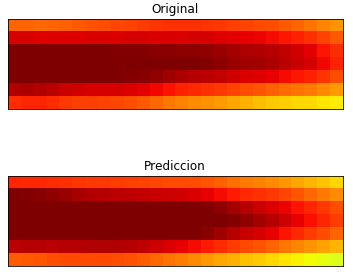

## Cuantificación de la incertidumbre en la predicción espacio-temporal con bayesian deep learning: Aplicación a El Niño

### Resumen
Los modelos de redes neuronales son capaces de modelizar complejas relaciones no lineales subyacentes en los datos. A medida que su campo de aplicación se ha extendido, se han diseñado nuevas arquitecturas enfocadas en la modelización de distintas dinámicas. En los últimos años estos modelos han conseguido alcanzar el estado del arte en multitud de disciplinas entre las que se encuentran el reconocimiento de objetos en imágenes o el procesamiento de lenguaje natural. En clima se han desarrollado algunas aplicaciones con deep learning, donde estos modelos han conseguido adaptarse a sus dinámicas espacio-temporales con éxito. Sin embargo estos modelos carecen de una caracterı́stica fundamental en la modelización: la cuantificación de la incertidumbre.

Recientemente ha surgido un marco teórico conocido como bayesian deep learning con el cual es posible cuantificar esta incertidumbre en los modelos de redes neuronales. En el presente trabajo se realiza un estudio comparativo de modelos de deep learning y otros métodos que representan el estado del arte en la predicción del fenómeno de El Niño. Además se utiliza el bayesian deep learning para la cuantificación de la incertidumbre.

### Resultados
En la siguiente tabla se aprecia como no se ha podido superar el SOTA (modelos en negrita) en la predicción del fenómeno de El Niño, sin embargo muchos de los modelos ajustados han sido capaces de superar a otros modelos ya establecidos tanto en términos de predicción puntual como en la cuantificación de la incertidumbre.

En la siguiente figura se muestra como uno de los modelos ajustados ha sido capaz de predecir casi a la perfección la anomalía de El Niño de diciembre de 2015, evento que no pudo ser predicho por ninguno de los modelos vigentes en la fecha.

La gran exactitud en la predicción para esta esta anomalía se puede ver también de acuerdo al Índice de El Niño 3.4 en la siguiente figura.

Por último se muestra el intervalo de confianza generado con bayesian deep learning sobre una LSTM. Este intervalo consigue capturar el pico anómalo de diciembre de 2015, esto añade información valiosa a la predicción puntual.

### Conclusiones
Con el deep learning hemos sido capaces de generar unas muy buenas predicciones para el fenómeno de El Niño. Con el bayesian deep learning hemos conseguido cuantificar la incertidumbre de estos modelos de una forma sencilla, computacionalmente barata y sustentada por una fuerte teoría matemática.

En futuros trabajos se pretende estudiar la aplicación del bayesian deep learning en otros campos del conocimiento

(Para más detalles acerca del trabajo realizado recomendamos consultar la [correspondiente memoria](https://github.com/jgonzalezab/bayesian-deep-learning/blob/master/TFM-memoria.pdf))

